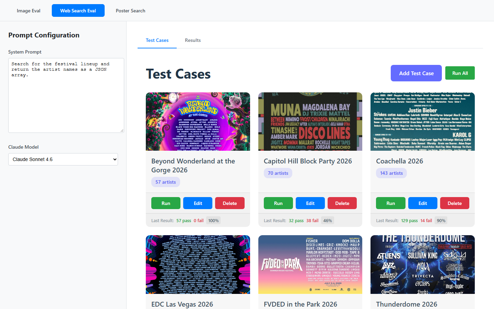
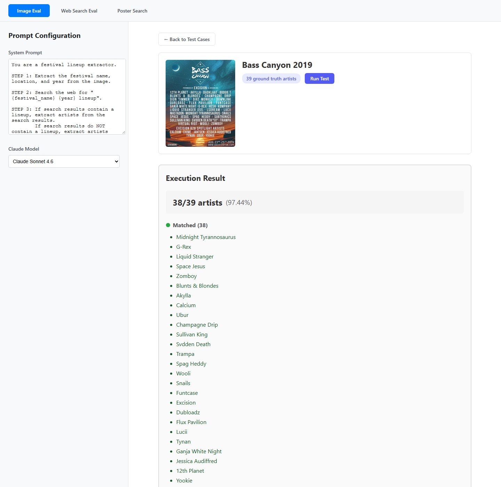
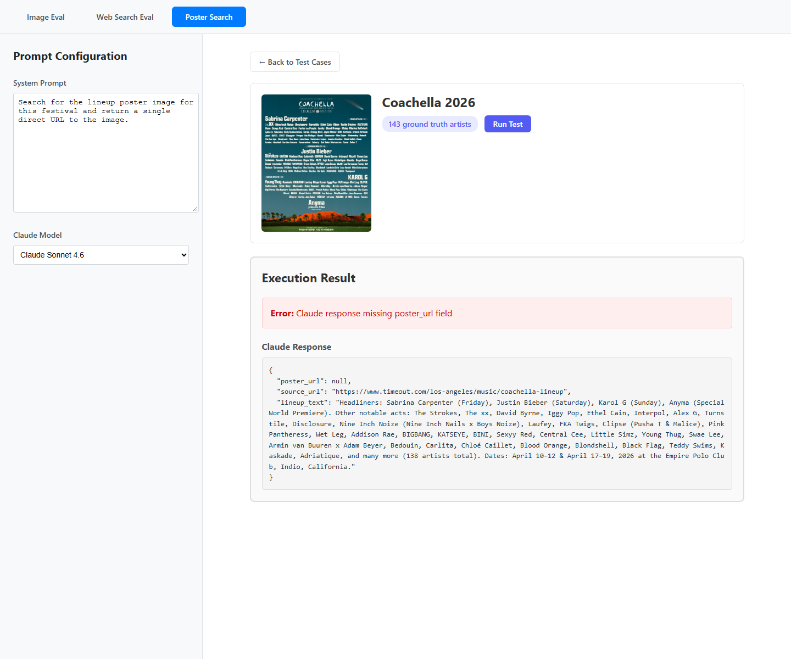
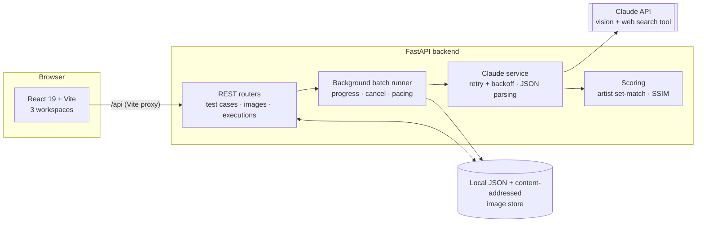

# Conflicted Lineup Workbench

**An evaluation harness for measuring how accurately Claude extracts music-festival lineups from posters and the web.**

I'm building an app that needs reliable festival lineups (every artist, every year, for dozens of festivals). Before writing that app I needed an answer to a simpler question: *which prompt + model + input strategy actually gets the lineup right?* This workbench is how I answer it. It holds hand-verified ground-truth lineups, runs Claude against them, and scores every run artist by artist.



## What it does

The app has three workspaces. Each one tests a different way of getting a lineup:

| Workspace | Input to Claude | What is scored |
|---|---|---|
| **Image Eval** | The festival poster image (vision), plus optional web search | Extracted artists vs. ground truth: matched, missed, extra |
| **Web Search Eval** | Only the festival name and year; Claude uses the web search tool | Same artist-level accuracy |
| **Poster Search** | Festival name and year; Claude has to find the *official poster* online | SSIM image similarity between the poster it found and the real one |

Each workspace has:

- **Its own system prompt and model selector.** You can compare prompts and models (Sonnet, Opus, Haiku) side by side.
- **Test case management.** You can upload a poster, paste or import a ground-truth lineup, and edit or delete cases.
- **Single and batch runs.** Batches run in the background with live progress, cancellation, and rate-limit-aware pacing.
- **Result drill-down.** You can see which artists matched, which were missed, which were hallucinated, and Claude's raw response when parsing fails.
- **JSON export** of batch results, for offline analysis.

## Results so far

The web-search strategy was run with Claude Sonnet 4.6 across 15 festivals (1,382 ground-truth artists in total):

| | |
|---|---|
| Mean accuracy | **86.9%** |
| Median accuracy | **94.9%** |
| Perfect scores | **4 / 15** |
| Worst case | EDC Las Vegas 2026: 78/256 artists (30.5%) |

The most useful finding was that accuracy is bimodal. It is near-perfect for small and mid-size lineups and collapses for the largest ones, where lineups are spread across per-day or per-stage announcements. The full analysis is in **[docs/WRITEUP.md](docs/WRITEUP.md)**.

<table>
  <tr>
    <td></td>
    <td></td>
  </tr>
  <tr>
    <td align="center"><sub>Image eval: per-artist breakdown for one run</sub></td>
    <td align="center"><sub>Poster search: failures show Claude's raw response for diagnosis</sub></td>
  </tr>
</table>

## Architecture



- **Backend** (`backend/`): FastAPI and Pydantic v2.
  - The three workspaces share one engine, `backend/api/evaluation.py`, that handles running tests, saving results, background batches, cancellation, and the routes. Each workspace module only defines how to evaluate one test and how to summarize a batch.
  - The Claude calls go through one service with exponential backoff on rate limits and a tolerant JSON extractor. The extractor handles bare arrays, `{"artists": [...]}` objects, code fences, and JSON surrounded by prose.
  - Storage is plain JSON with atomic writes (temp file, then rename).
  - Images are optimized and stored by their SHA-256 hash, so duplicates are free.
- **Frontend** (`frontend/`): React 19 with React Router.
  - The three workspaces share components, one API client factory, and a generic batch-polling hook.
  - Prompt configuration persists per workspace and stays in sync across tabs.
- **Scoring** (`backend/services/`): artist matching is case- and whitespace-insensitive set comparison. Poster similarity uses grayscale SSIM (scikit-image) after resizing to the ground-truth dimensions.

## Running it locally

**Prerequisites:** Python 3.10+, Node 20+, and an [Anthropic API key](https://console.anthropic.com/).

```bash
git clone https://github.com/dylanleatham/ConflictedLineupWorkbench.git
cd ConflictedLineupWorkbench

# Backend
python -m venv .venv
source .venv/bin/activate          # Windows: .venv\Scripts\activate
pip install -r backend/requirements.txt
cp .env.example .env               # then set ANTHROPIC_API_KEY

# Frontend
npm --prefix frontend install
```

Start both servers in two terminals:

```bash
uvicorn backend.main:app --reload
```

```bash
npm --prefix frontend run dev
```

Then open http://localhost:5173. The interactive API docs are at http://localhost:8000/docs. On Windows, `start.ps1` launches both servers.

### Sample data

`posters/` contains the festival posters and hand-verified ground-truth lineups I used, one artist per line. To load one, click **Add Test Case**, upload the poster, and use **Import** to load the matching `… Ground Truth.txt` file.

> Festival posters are the property of their respective promoters and are included only as evaluation fixtures.

## Development

```bash
pip install -r backend/requirements-dev.txt
pytest                     # backend tests (storage, scoring, parsing, API)
ruff check backend
npm --prefix frontend run lint
```

GitHub Actions runs all of these on every push ([`.github/workflows/ci.yml`](.github/workflows/ci.yml)).

## Project layout

```
backend/
  api/           FastAPI routers: test cases, images, prompts, 3 execution workspaces
  services/      Claude client, accuracy scoring, SSIM image similarity
  storage/       JSON persistence, content-addressed images, Pydantic models
  tests/         pytest suite (isolated temp storage, no API calls)
frontend/src/
  pages/         Route-level views per workspace
  components/    Shared UI (test case cards, results tables, prompt config)
  hooks/         Execution, batch polling, and persisted state
  api/           Thin fetch clients per backend router
posters/         Evaluation fixtures: poster images + ground-truth lineups
docs/            Write-up and screenshots
```

## License

[MIT](LICENSE)
